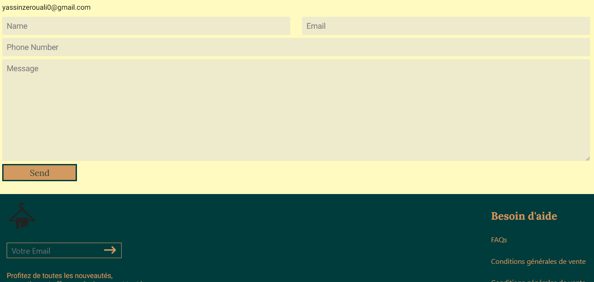

# E-Commerce Website

This is an e-commerce website built with React.js. It allows users to browse products, add them to their shopping cart, and proceed to checkout.

## Features

- **Product Listings:** View a list of available products with details such as name, price, and image.
- **Shopping Cart:** Add products to the shopping cart, adjust quantities, and remove items.
- **Checkout:** Not Yet
- **Responsive Design:** The website is responsive and adapts to different screen sizes for optimal viewing on various devices.

## Technologies Used

- **React.js:** Frontend framework for building user interfaces.
- **React Router:** Library for managing navigation within a React application.
- **Context API:** Used for state management to handle global data such as shopping cart items.
- **CSS:** Custom styling for the user interface.
- **HTML:** Structure and layout of the web pages.
- **JavaScript:** Programming language for interactivity and functionality.

## Setup

1. Clone the repository to your local machine:

   ```bash
   git clone https://github.com/0uali-Yassine/e-commerce-app.git

2. Navigate to the project directory:

    ```bash
    cd ecommerce-app

3. Install dependencies:

   ```bash
    npm install

4. Start the development server:
    ```bash
    npm start

5. Open your browser and visit http://localhost:3000 to view the website

## Screenshots
1. **Homepage:**




## Acknowledgements

[React Router](https://www.npmjs.com/package/react-router-dom)
[React Icons](https://react-icons.github.io/react-icons)
[Fake API](https://fakestoreapi.com/docs)

## Author
[Yassin Zerouali] - [https://github.com/0uali-Yassine]

## License
This project is licensed under the MIT License - see the LICENSE file for details.


